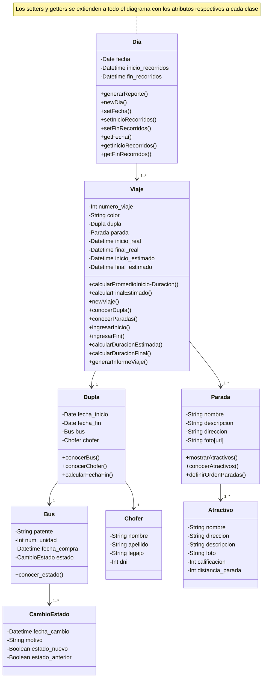

# BusTuristico

Diagrama de Clases UML

```mermaid
classDiagram

Dia --> "1..*" Viaje
Viaje --> "1" Dupla
Dupla --> "1" Bus
Dupla --> "1" Chofer

Bus --> "1..*" CambioEstado
Viaje --> "1..*" Parada
Parada --> "1..*" Atractivo

    class Parada{
        -String nombre
        -String descripcion
        -String direccion
        -String foto[url]
        +mostrarAtractivos()
        +conocerAtractivos()
        +definirOrdenParadas()
    }
    class Atractivo{
        -String nombre
        -String direccion
        -String descripcion
        -String foto
        -Int calificacion
        -Int distancia_parada
    }
    class Bus{
        -String patente
        -Int num_unidad
        -Datetime fecha_compra
        -CambioEstado estado
        +conocer_estado()
    }
    class CambioEstado{
        -Datetime fecha_cambio
        -String motivo
        -Boolean estado_nuevo
        -Boolean estado_anterior
    }
    class Chofer{
        -String nombre
        -String apellido
        -String legajo
        -Int dni
    }
    class Dia {
        -Date fecha
        -Datetime inicio_recorridos
        -Datetime fin_recorridos
        +generarReporte()
        +newDia()
        +setFecha()
        +setInicioRecorridos()
        +setFinRecorridos()
        +getFecha()
        +getInicioRecorridos()
        +getFinRecorridos()
    }
    note for Dia "Los setters y getters se extienden a todo el diagrama con los atributos respectivos a cada clase"

    class Viaje {
        -Int numero_viaje
        -String color
        -Dupla dupla
        -Parada parada
        -Datetime inicio_real
        -Datetime final_real
        -Datetime inicio_estimado
        -Datetime final_estimado
        +calcularPromedioInicio-Duracion()
        +calcularFinalEstimado()
        +newViaje()
        +conocerDupla()
        +conocerParadas()
        +ingresarInicio()
        +ingresarFin()
        +calcularDuracionEstimada()
        +calcularDuracionFinal()
        +generarInformeViaje()
    }
    class Dupla {
        -Date fecha_inicio
        -Date fecha_fin
        -Bus bus
        -Chofer chofer
        +conocerBus()
        +conocerChofer()
        +calcularFechaFin()
    }
```

